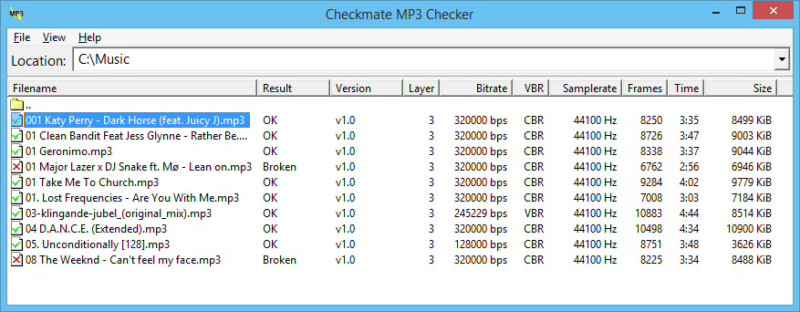

# Checkmate MP3 checker

Checkmate MP3 Checker is a free program that checks MP3 files for errors. It
scans MP3 files to see if the frames are where they are supposed to be, whether
the frame headers are correct and whether the frame headers are consistent
throughout the file. It reports some information on each file and an indication
whether the file is good or bad.

There are two interfaces available:
* Checkmate MP3 Checker, a Windows interface that looks like Windows Explorer;
* mpck, a command line program that runs on multiple platforms.

[Download the latest release](https://github.com/Sjord/checkmate/releases).

## Checkmate MP3 Checker

Checkmate MP3 Checker is a Windows interface to check MP3 files:

You can download the Windows executable on the
[releases](https://github.com/Sjord/checkmate/releases) page.

## Mpck

Example:

    $ mpck '001 Katy Perry - Dark Horse (feat. Juicy J).mp3'
    SUMMARY: 001 Katy Perry - Dark Horse (feat. Juicy J).mp3
        version                       MPEG v1.0
        layer                         3
        bitrate                       320000 bps
        samplerate                    44100 Hz
        frames                        8250
        time                          3:35.510
        unidentified                  0 b (0%)
        errors                        none
        result                        Ok

### Building

If your release does not have `configure`, first run

    ./autogen.sh

After that, it is the normal build method:

    ./configure
    make
    make install

For Windows there is a Visual Studio project in the `vc++` directory.

### Usage

    Usage: mpck [OPTION]... [FILE]...

    Verbosity:
       -v, --verbose        print some extra info
       -q, --quiet          print only Ok or Bad per file
       -B, --badonly        only report bad files
    Other options:
       -R, --recursive      check directories recursively
       -e, --extention=EXT  only check files ending on .EXT
       -r                   short for -R -e mp3
       -m, --maxname=NUM    report bad for filenames which exceed NUM characters
       -n, --namecheck      check for strange characters in the filename
       -x, --xmloutput      output results in XML
       -h, --help           print this help, then exit
       -V, --version        print version information

### Output

If all is well, mpck will output something like this:

    SUMMARY: mp3/test.mp3
        version                       MPEG v1.0
        layer                         3
        bitrate                       128000 bps
        samplerate                    44100 Hz
        frames                        7271
        time                          3:09.936
        unidentified                  0 b (0%)
        errors                        none
        result                        Ok

Occasionally, something goes wrong and mpck prints an error. It has one
of the following formats:
1) mpck: stat on blah failed
2) mpck:bla: foo bar error
3) mpck:bla:34003: yet another error

Number 1 indicates a general error. Number 2 means an error occured in file
bla. Number 3 says an error occured in file bla, at offset 34003 (decimal).

### Exit status

mpck returns one of the following values:

    0               Everything went OK and no broken files were found.
    1               Everything went OK, but at least one broken file was found.
    2 (ENOENT)      File or directory not found, stat failed.
    4 (EINTR)       The program received a SIGINT.
    5 (EIO)         Read error.
    12 (ENOMEM)     Malloc failed due to memory shortage.
    21 (EISDIR)     The given file is a directory.
    22 (EINVAL)     Invalid argument, no filename supplied.
    36 (ENAMETOOLONG) File extention or file name is too long.

## License

Both Checkmate mpck and Checkmate MP3 checker are licensed under the [GNU
General Public License](COPYING), which gives you permission to modify and
distribute the software as you like, as long as you include the source code. 

